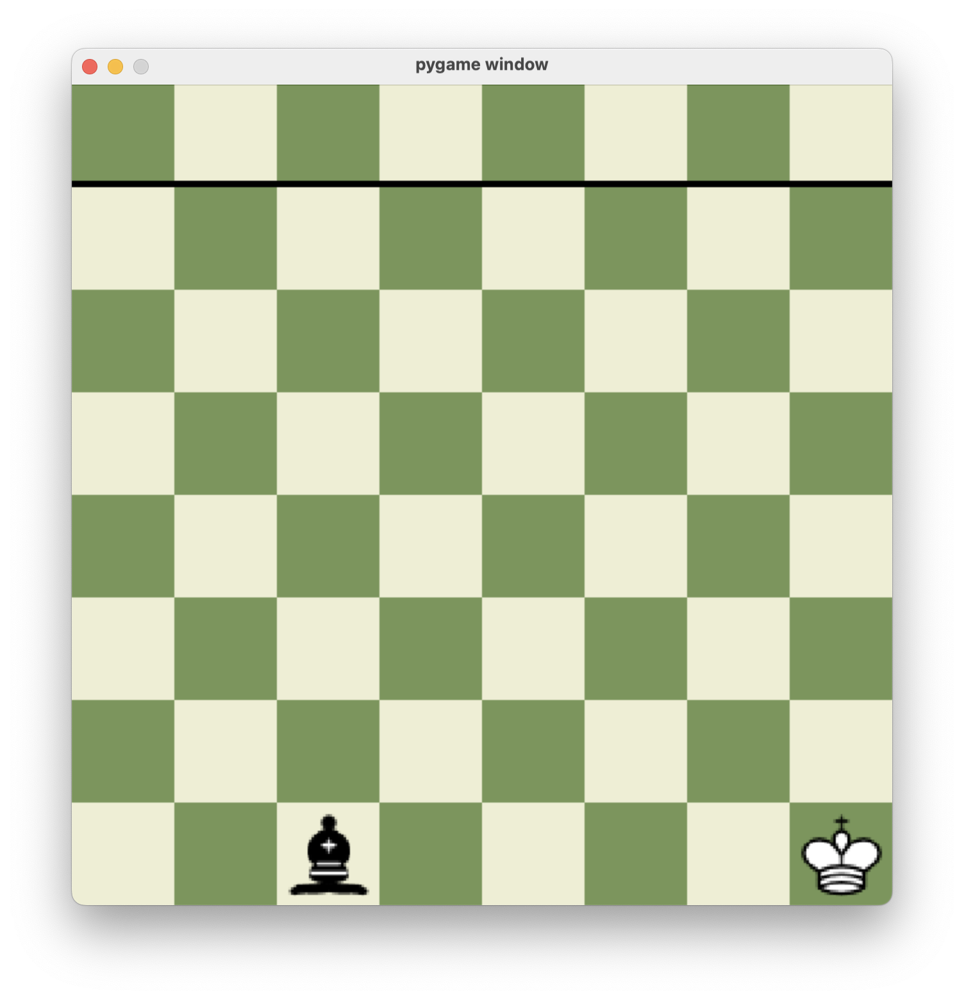
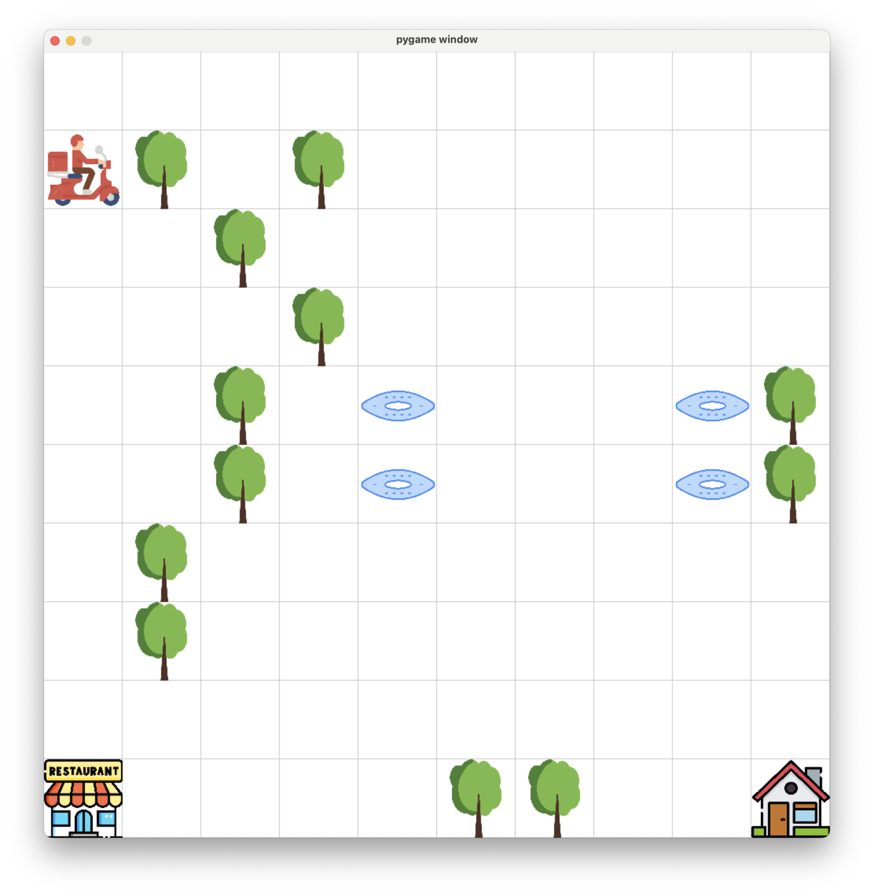

I've provided 2 solutions for the assignment 1. 
first I've implemented the racing kings but as talked I've worked on something else which was the delivery.

# About the Racing kings (not 100% complete)
    this is the very basic implementation for the racing kings game,
    for now it only has one opponent piece to make it super easy.

    you can learn the game from chess.com
    (https://www.chess.com/terms/racing-kings-chess),
    Ive used images from here:
    https://commons.wikimedia.org/wiki/Category:SVG_chess_pieces




# Run the project
to run the program you should run this commands:

```
$ virtualenv <env_name>
$ source <env_name>/bin/activate
(<env_name>)$ pip install -r path/to/requirements.txt 
```


# About the delivery:
    the icons are from freepik.com
    the environment designed for a delivery to pick up the food from the restourant and give it to the customer.
    trees are the obstacles and holes are the hell state,
    also going to custommer without the burger is a hell state as the hungery custommer will eat the delivery guy.


